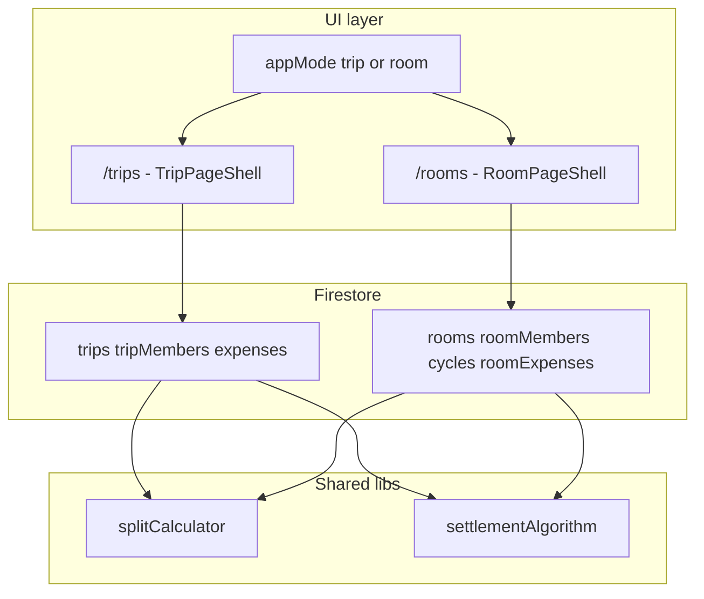

# TripMate — Agent Guide (GEMINI.md)

**Read this file before changing code.** TripMate is a dual-product app: **Trips** (original) and **Rooms / Roommates** (added in parallel). Breaking trip flows is the highest-risk failure mode.

---

## 1. Product overview

| Product | Purpose | Routes | Firestore collections |
|--------|---------|--------|------------------------|
| **Trips** | Group travel expenses | `/trips/*`, `/trips/new` | `trips`, `tripMembers`, `expenses`, `settlements`, `memories` |
| **Rooms** | Shared home / PG monthly expenses | `/rooms/*`, `/rooms/new` | `rooms`, `roomMembers`, `cycles`, `roomExpenses`, `roomSettlements`, `carryForwardBalances`, `rentPayments` |

There is **no** unified `workspaces` collection yet. Trips were **not migrated**. Roommate data lives in **parallel collections** only.

### Workspace UI mode (Trip vs Room)

Users with `primaryUseCase: 'both'` (or legacy users with both trips and rooms) see a **Trips / Rooms** toggle in the navbar.

- **`activeMode`**: `'trip' | 'room'` — controls which UI is shown (nav, dashboard, route guard).
- Stored on `users.activeMode`, `localStorage` (`tripmate_app_mode_{uid}`), and Redux `appMode` slice.
- **`WorkspaceGuard`**: redirects `/trips/*` when in room mode and `/rooms/*` when in trip mode.

**Do not** show trip and room content on the same screen unless explicitly requested. Respect `useAppMode()` (`isTripMode` / `isRoomMode`).

### Legacy accounts (pre-roommate)

- Same Firebase **uid** — nothing is deleted or migrated.
- Missing `primaryUseCase` → treated as **`trips`** (trip-only UI, no switcher until Profile → **Both**).
- Missing `activeMode` → derived via `resolveAppMode()` in `src/lib/appMode.ts`.

---

## 2. Tech stack (unchanged)

- **Next.js 14** App Router, TypeScript, Tailwind, shadcn/ui (`src/components/ui`)
- **Redux Toolkit** — `src/features/*`, `src/store/index.ts`
- **Firebase** — Auth, Firestore, Storage, FCM; **no REST API** for domain CRUD
- **Forms** — React Hook Form + Zod
- **PWA** — `next-pwa`, `npm run messaging-sw` after env changes

---

## 3. Critical architecture rules (DO / DO NOT)

### DO

1. **Keep trip and room code in separate folders**

   | Area | Path | Rule |
   |------|------|------|
   | Trips | `src/app/trips/**`, `src/features/trips/**`, `src/components/trips/**` | No imports from `rooms` feature UI |
   | Rooms | `src/app/rooms/**`, `src/features/rooms/**`, `src/components/rooms/**` | No imports from `trips` feature UI |
   | Shared logic | `src/lib/splitCalculator.ts`, `settlementAlgorithm.ts`, `utils.ts`, `appMode.ts` | Small, behavior-preserving changes only for trips |

2. **Use the Firestore barrel for imports**

   ```ts
   import { getTrip, createExpense } from '@/firebase/firestore';
   import { createRoom, getRoomExpenses } from '@/firebase/firestore';
   ```

   Implementation lives in split modules (see §4). **Do not** put all new code back into one giant file.

3. **Use existing member key convention**

   - `getMemberKey(member)` in `src/lib/utils.ts` returns **`member.id`** (Firestore doc id), not `userId`.
   - `paidBy` and `splitBetween[].uid` use that key for **both** trips and rooms.

4. **Reuse settlement math**

   - Trips: `computeSettlements(expenses, members, tripId)` → `Settlement[]`
   - Rooms: `computeRoomSettlements(expenses, members, roomId, carryForward[])` → includes carry-forward
   - Generic shape: `SplittableExpense` in `settlementAlgorithm.ts`
   - Run `npm run test` after changing settlement logic.

5. **Scope new Firestore rules** to room collections with `isRoomMember` / `isRoomEditor` — do not loosen trip `expenses` rules unless intentional.

6. **Register new Redux slices** in `src/store/index.ts` and extend `serializableCheck.ignoredPaths` if storing Timestamps.

7. **Wrap authenticated pages** with `ProtectedRoute` + `AppShell` (same as dashboard).

8. **Check app mode** on dashboard, sidebar, bottom nav, and any global CTAs using `useAppMode()`.

### DO NOT

1. **Do not** rename `tripId` on `Expense` or move trips into a `workspaces` collection without an explicit migration plan.
2. **Do not** extend `expensesSlice` / `tripsSlice` for roommate data — use `roomExpenses`, `rooms`, `roomSettlements` slices.
3. **Do not** modify `useRealtimeTrip` for rooms — use `useRealtimeRoom` (`src/hooks/useRealtimeRoom.ts`).
4. **Do not** extend `TripNav` for room tabs — use `RoomNav` + `RoomPageShell`.
5. **Do not** put roommate-only fields on the shared `expenses` collection — use `roomExpenses` with `cycleId`.
6. **Do not** change `calculateNetBalances` / trip `computeSettlements` behavior when adding room features — rooms use `computeRoomSettlements` + carry-forward.
7. **Do not** assume `primaryUseCase === 'both'` means show both UIs at once — use **`activeMode`** for visibility.
8. **Do not** edit `.cursor/plans/*` or user plan files unless asked.

---

## 4. Firestore data access layout

```
src/firebase/
  firestore.ts           # Re-exports only (backward compatible)
  db.ts                  # getFirebaseDb() helper
  users.firestore.ts     # getUser, updateUser (syncs tripMembers + roomMembers on profile update)
  trips.firestore.ts     # All trip CRUD (moved from monolith)
  rooms.firestore.ts
  cycles.firestore.ts    # ensureActiveCycle, formatCycleLabel
  roomExpenses.firestore.ts
  roomSettlements.firestore.ts
  carryForward.firestore.ts
  rent.firestore.ts
  auth.ts, config.ts, storage.ts
```

**When adding trip APIs:** edit `trips.firestore.ts`, re-export from `firestore.ts`.  
**When adding room APIs:** add or edit `*.firestore.ts` under `firebase/`, re-export from `firestore.ts`.

**Avoid** editing trip functions while implementing unrelated room features (merge conflict hotspot historically was single `firestore.ts`).

---

## 5. Firestore collections reference

### Trips (original)

- `users` — profile, `primaryUseCase`, `activeMode`, `fcmToken`, `notifyEnabled`
- `trips`, `tripMembers` (doc id often `{tripId}_{userId}`)
- `expenses` — `tripId`, `expenseType: planned | actual`, splits
- `settlements`, `memories`

### Rooms (roommate module)

- `rooms` — no end date; `status: active`
- `roomMembers` — same invite pattern as `tripMembers`
- `cycles` — `month`, `year`, `status: active | closed | archived`; one active per room; `ensureActiveCycle(roomId)` on load
- `roomExpenses` — `cycleId`, `title`, `expenseDate`, roommate categories (`src/types/roomExpense.ts`)
- `carryForwardBalances` — cross-month dues (`pending | partial | settled`)
- `rentPayments` — per cycle, per member
- `roomSettlements` — persisted settlement history

Indexes: `firestore.indexes.json`. Rules: `firestore.rules` (`isRoomMember`, `isRoomEditor`).

---

## 6. Redux slices

| Slice | Purpose |
|-------|---------|
| `auth` | User profile |
| `trips` | Trip list, current trip, **trip** members |
| `expenses` | Trip expenses only |
| `settlements` | Trip settlements |
| `memories` | Trip memories |
| `rooms` | Room list, current room, members, **activeCycle** |
| `roomExpenses` | Room expenses for active cycle |
| `roomSettlements` | Computed + saved + carry-forward |
| `appMode` | `mode`, `canSwitch`, `initialized` |

Thunks live beside slices in `src/features/{name}/*Thunks.ts`.

---

## 7. Key hooks & providers

| File | Role |
|------|------|
| `AuthProvider` | Firebase auth listener |
| `AppModeProvider` | Resolves mode, fetches trips+rooms for switch eligibility |
| `useAppMode()` | `switchMode`, `isTripMode`, `isRoomMode`, `canSwitch` |
| `useTrip` / `useRealtimeTrip` | Trip pages only |
| `useRoom` / `useRealtimeRoom` | Room pages only |
| `useRoomSettlement` | Room settlement + carry-forward |

Layout order in `src/app/layout.tsx`: `ReduxProvider` → `AuthProvider` → `AppModeProvider` → `FCMProvider`.

---

## 8. Settlement & splits

| UI label | `splitType` in code |
|----------|---------------------|
| Equal | `equal` |
| Percentage | `percent` |
| Custom amounts | `unequal` |
| Selected members only | same types, but `splitBetween` / `selectedMembers` lists **only chosen** member keys |

Room expenses are all **actual** (no planned/actual toggle in MVP).

**Carry-forward:** Unpaid pairwise balances from prior cycles live in `carryForwardBalances`. `computeRoomSettlements` applies them before greedy debt simplification. Unit test: `src/lib/settlementAlgorithm.test.ts` (`npm run test`).

---

## 9. Notifications (FCM)

Cloud Functions in `functions/src/index.ts`:

- `sendTripInvite`, `onExpenseCreated` (trips)
- `onRoomExpenseCreated` (rooms)

Client wrappers: `src/services/fcmService.ts`. Non-blocking if functions not deployed.

---

## 10. UI patterns

- **Trip shell:** `TripPageShell` + `TripNav`
- **Room shell:** `RoomPageShell` + `RoomNav`
- **Dashboard:** trip bento + `TripInvitations` when `isTripMode`; `RoomsDashboardSection` when `isRoomMode`
- **Sidebar / BottomNav:** links filtered by `useAppMode()` in `Sidebar.tsx`, `BottomNav.tsx`
- **Mode switch:** `WorkspaceModeSwitch.tsx` in `Navbar` (visible when `canSwitch`)

Styling: Tailwind + Framer Motion; primary `#6366F1`; dark mode via `dark` class.

---

## 11. Types (`src/types/`)

| File | Notes |
|------|-------|
| `trip.ts`, `expense.ts`, `member.ts`, `settlement.ts` | Trip domain |
| `room.ts`, `roomMember.ts`, `cycle.ts`, `roomExpense.ts`, `roomSettlement.ts` | Room domain |
| `user.ts` | `PrimaryUseCase`, `AppMode`, `activeMode` |
| `workspace.ts` | Thin `WorkspaceRef` type only (no Firestore workspace yet) |

---

## 12. Safe change checklist (before PR / handoff)

1. `npx tsc --noEmit` — types
2. `npm run test` — settlement tests (if touching `settlementAlgorithm.ts`)
3. `npm run build` — full Next build (run once when done)
4. If new Firestore queries → update `firestore.indexes.json` and deploy rules/indexes
5. If new storage paths → update `storage.rules` and deploy storage
6. Confirm trip flows still work: create trip, add expense, settlement page
7. Confirm room flows: create room, cycle auto-create, expense, settlement with carry-forward
8. If both-mode: toggle Trips/Rooms and confirm the other module’s routes redirect

---

## 13. Common tasks — where to edit

| Task | Files |
|------|-------|
| New trip feature | `src/app/trips/...`, `trips.firestore.ts`, `features/trips/` |
| New room feature | `src/app/rooms/...`, `rooms.firestore.ts` or sibling, `features/rooms/` |
| Registration / profile prefs | `src/app/(auth)/register`, `src/app/profile`, `firebase/auth.ts` |
| Global nav / mode | `Sidebar.tsx`, `BottomNav.tsx`, `Navbar.tsx`, `appMode.ts`, `AppModeProvider.tsx` |
| Split math | `splitCalculator.ts`, `settlementAlgorithm.ts` + tests |
| Push notifications | `functions/src/index.ts`, `fcmService.ts` |

---

## 14. Phase 2+ (not implemented — do not half-wire)

Planned later, separate collections: `ideas`, `assets`, `deposits`, `roomNotices`, chores, visitors, inventory, utility meters. **Do not** add partial schema without product sign-off.

---

## 15. Environment & deploy

- `.env.local` from `.env.local.example`; run `npm run messaging-sw` after Firebase env changes
- Deploy: `npm run firebase:deploy` (firestore, storage, functions)
- **Storage 403 on profile photo:** deploy storage rules (`storage.rules`); see incident notes below

### Profile photo 403 incident

- Upload path: `users/{uid}/profile.{ext}` via `uploadProfilePhoto` in `storage.ts`
- Fix: deploy storage rules; verify `NEXT_PUBLIC_FIREBASE_STORAGE_BUCKET` matches project

---

## 16. Git / scope discipline

- Prefer **small PRs**; trip files off-limits when doing room-only work
- **Do not** commit `.env.local`, secrets, or `.refact/` tooling state unless user asks
- **Do not** amend commits or force-push unless user explicitly requests

---

## 17. Quick mental model



**When in doubt:** add roommate code under `rooms/` and `room*`, re-export Firestore helpers, gate UI with `useAppMode()`, and run `tsc` + `test` + `build`.
